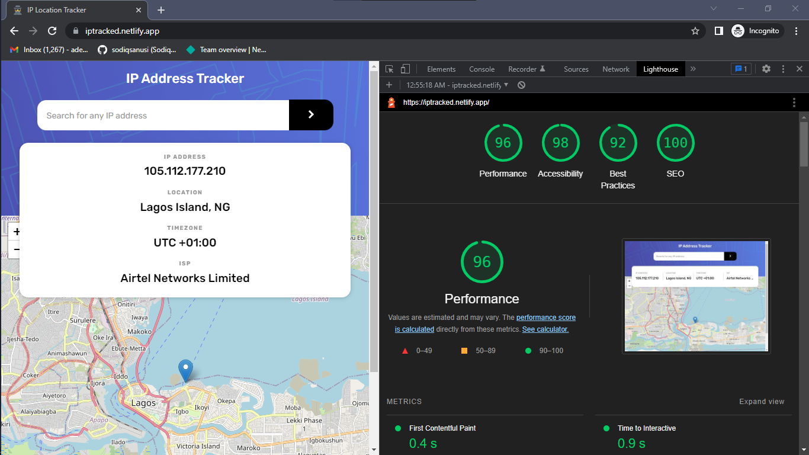

# IP Tracker

## Table of contents

- [Overview](#overview)
  - [The challenge](#the-challenge)
  - [Screenshot](#screenshot)
  - [Links](#links)
- [My process](#my-process)
  - [Built with](#built-with)
  - [What I learned](#what-i-learned)
  - [Continued development](#continued-development)
  - [Useful resources](#useful-resources)
- [Author](#author)
- [Acknowledgments](#acknowledgments)

## Overview
The goal was to build an application that gets the user's IP address on load and renders a live map that shows the location of the IP address. The application should also be able to render the details and location of an inputted IP address if queried.

### The challenge
Users should be able to:

- View the optimal layout for each page depending on their device's screen size.
- See hover states for all interactive elements on the page.
- See their own IP Address on the map on the initial page load.
- Search for any IP addresses and see the key information and location.

### Screenshot

### Links
- Solution URL: [https://github.com/sodiqsanusi/ipAddress-tracker/](https://github.com/sodiqsanusi/ipAddress-tracker/)
- Live Site URL: [https://iptracked.netlify.app/](https://iptracked.netlify.app/)

## My process
Next.js can be annoying😭. I ran into numerous bugs on this project due to me being obsessed with trying out server-side rendering where it wasn't possible. Anyhow tho, I've learnt my lessons I guess. The process to build this was like the others: Build base styling of app first, determine best way to get data from API, then implement the gotten data on the application's interface without breaking things.  

### Built with
- CSS Modules.
- Mobile-first workflow.
- [Next.js](https://nextjs.org/) - React framework.
- [LeafletJS](https://leafletjs.com/) - JavaScript library for creating the maps.

### What I learned
A lot of mistakes I made in building this sincerely. By not thinking about the best render method for getting data in the application I ran into a lot of problems and this is something I've decided to always consider first before even writing code and all. This is the first time I'm also using SSR, so it was enlightening to do that alongside CSR in the same application.  

### Continued development
Uhmm, this is still one of my firsts with Next and I'll really love to dive deep into building apps with the framework. I'm planning to build a small portfolio site also sha, probably after this. 

**Summary:** I'm going to try building more apps with Next.js and I may have a new portfolio soon🤞🏾.

### Useful resources
- [API for getting IP addresses](https://geo.ipify.org/docs) - You need an API for getting live data on IP addresses? This was really helpful.
- [Next.js Leaflet Starter - Colby Fayock](https://next-leaflet-starter.netlify.app/) - So LeafletJS was made for React naturally, so there was a lot of syntax changes when used in Next. This app by Colby helped a lot in understanding those changes, I even had to use part of his code somewhere, embarrassing right? 

## Author
- Twitter - [@sodiqsanusi0](https://www.twitter.com/sodiqsanusi0)
- LinkedIn - [Sodiq Sanusi](https://www.linkedin.com/in/sodiqsanusi0)

## Acknowledgments
The FrontendMentor team👏🏾.
